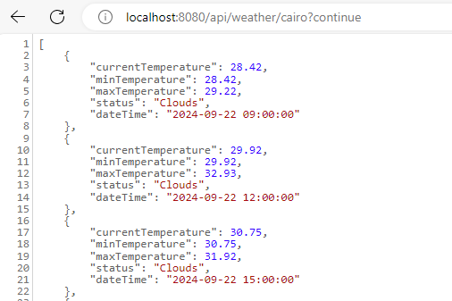
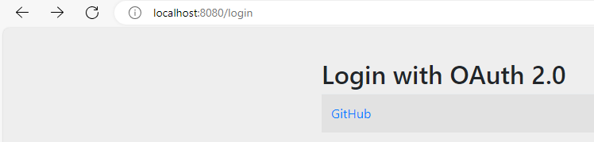
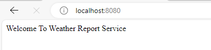
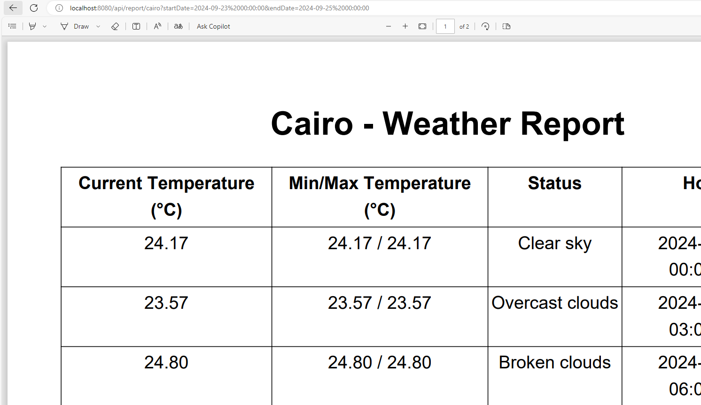

# Weather Report Service

## Introduction

This project is a Weather Report Service built using Spring Boot. It fetches weather data from the OpenWeatherMap API and generates PDF reports based on user requests.

## Features

- Fetch weather data for a specified city.
- Generate and download weather reports in PDF format.
- Support for OAuth2 authentication.

## Technologies Used

- Java 17
- Spring Boot 3
- Spring WebFlux
- Spring Security
- OpenWeatherMap API
- iText PDF library
- MySQL Database

## Setup Instructions

### 1. Clone the repository

```
git clone https://github.com/ahmedSadek39/weather-report-service.git cd weather-report-service
```

### 2. Configure application properties

Update the `src/main/resources/application.properties` file with your database and OAuth2 configurations:

```properties
spring.datasource.url=jdbc:mysql://your-database-url 
spring.datasource.username=your-database-username 
spring.datasource.password=your-database-password

spring.security.oauth2.client.registration.github.clientId=your-client-id
spring.security.oauth2.client.registration.github.clientSecret=your-client-secret

weathermap.key=your-weathermap.key
```

### 3. Build the project

```
mvn clean install
```

### 4. Run the application

```
mvn spring-boot
```

### 5. Access the APIs

```properties
- Open your browser and navigate to http://localhost:8080/api/weather/{city} to get weather data for a specific city.
- Use http://localhost:8080/api/report/{city} to generate a weather report; must be authenticated before.
- Use http://localhost:8080/login to login with github to be authenticated.
- By default, the API fetches weather data from the current time until the same time tomorrow.
- If you need to get data for a specific interval within the next 5 days, pass startDate and endDate in the format yyyy-MM-dd HH:mm:ss. For example: http://localhost:8080/api/weather/cairo?startDate=2024-09-23 00:00:00&endDate=2024-09-25 00:00:00.
```

    1. get weather data `http://localhost:8080/api/weather/{city}`


    2. login with github `http://localhost:8080/login`



    3. get weather report 'http://localhost:8080/api/report/cairo?startDate=2024-09-23 00:00:00&endDate=2024-09-25 00:00:00'
